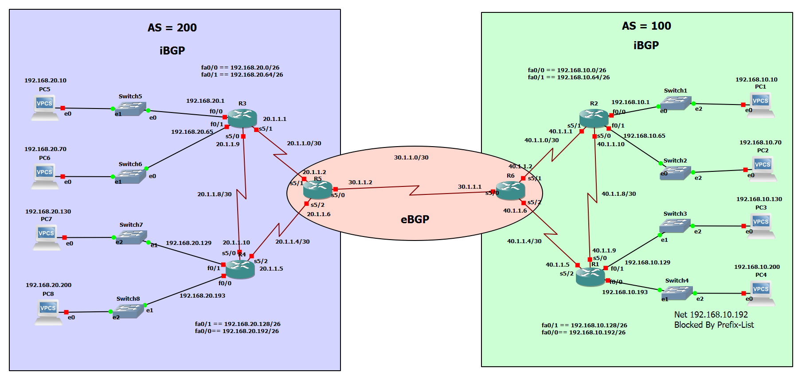

# BGP-iBGP-eBGP-prefix-lists-Lab
GNS3 lab for practicing BGP, iBGP, eBGP with prefix-lists
# BGP iBGP eBGP Prefix-List Lab on GNS3

## 🌐 Description
This GNS3 lab demonstrates BGP routing between two autonomous systems (AS 100 and AS 200) connected via eBGP, with iBGP configured within each AS. The lab also implements prefix lists to control which subnets are advertised across AS boundaries.

✅ Designed for practicing:
- eBGP peering between AS 100 and AS 200
- iBGP peering inside each AS
- Prefix-lists to filter specific subnets
- Basic static routing to direct default traffic
- Verifying route advertisements and filtering

---

## 🖥️ Topology Diagram
  
*(Replace this with your actual diagram image if hosting on GitHub — commit it as `topology.png`)*

---

## 🚀 Devices & Configurations
- **Routers:** 6 routers (R1-R6) configured with BGP (AS 100 and AS 200)
- **Switches:** Simulating LAN segments
- **End hosts:** PCs to test connectivity
- **Prefix Lists:**
  - AS 100 blocks advertising `192.168.10.192/26`

---

## 🔧 Requirements
- GNS3 v2.2.x or later
- Cisco IOS images or IOU/IOL (whichever your lab uses)
- Basic knowledge of BGP, iBGP, prefix-lists

---

## 🚀 How to Use This Lab
1. **Download the ZIP file.**
2. Open GNS3 → `File` → `Import portable project` → select the `.gns3project.zip`.
3. Let GNS3 extract and build the topology.
4. Start the devices and check console logs.
5. Verify:
   - `show ip bgp summary`
   - `show ip route`
   - `show ip prefix-list`
   - `show ip bgp neighbor received-routes`
6. Try pinging across AS boundaries to test reachability and prefix-list filtering.

---

## 🔍 Highlights
- **AS 100 (Green)**  
  - iBGP peers: R1, R2, R6
  - Prefix-list blocks advertising `192.168.10.192/26`

- **AS 200 (Blue)**  
  - iBGP peers: R3, R4, R5

- **eBGP peering:**  
  - Between R5 (AS 200) and R6 (AS 100) over `30.1.1.0/30`

---

## 💡 License
Feel free to fork, clone, and use for your study or internal training.  
Attribution appreciated if you share it online.

---
